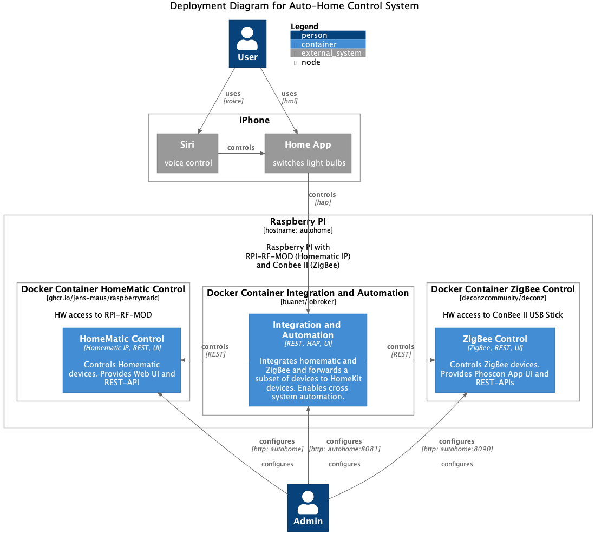

# Smart Home

## Business Opportunity or Problem

Multiple products for home automation are available on the market. Many solutions come with Mobile Apps for easy installation and means for integration with Amazon Alexa.

While those out of the box solutions are great for simple use-cases they often have limitations with respect to robustness and security.

An existing solution based on Commercial Of the Shelf (COTS) components is already in place.

The architectural goal is to enable the combination sensors and actuators from different vendors while providing high reliability and security.

Additionally, the solution has to be usable for small kids (2 years) and has to cost < 200€

## Scope and complexity
A home automation solution is required that is able to communicate with the sensors and actuators and provides a single UI via app and voice control.

### Functional Requirements
Floor heating
automatically control of temperature in each room
Warn if window remains open too long when it is cold outside
Light 
automatically switch on/off the lights based on presence of persons in the room
dimm down the lights at night
UI
switch on / off lights via voice control and mobile app
monitor status of lights via mobile app 
Constraints
Limited budget requires reuse of existing sensors, actuators and other devices :

Homematic motion sensors, temperature control, floor heating actuators
Tradfri Lights
Alexa
Apple iPhone and iPad
Relationship and communication
n/a

### Quality requirements
Compatibility:
Interoperability: enable HW components from different vendors
Reliability:
Availability: Robust heating. 
Availability: Robust light with manual switch on/off
fault tolerance: basic functionality needs to continue working even if central control is off
accessibility: via physical switch, app, voice
Usability: 
user interface Aestetics: single interface that integrates all devices
learnability: kids need to be able to use it. 
Security
security: no access from internet, no data on vendor servers.
confidentiality: kids can control lights but no heating profiles.

## Baseline
### COTS solution for floor heating with Homematic IP

pros:

fault tolerance: Basic functionality (e.g. temperature control) available even if Homematic Cloud Access Point is not available
(realized via direct connection between Sensors and actuators and logic in sensor modules)
budget: rather low costs
cons:

Availability: If Homematic Cloud is not available or internet access is broken,
then it is not possible to set modify settings via App and Homematic IP Access Point. 
Availability: If child-proof lock is enabled for thermostat controls and control via app is not possible,
then no modifications of settings are possible since disabling the child-proof lock is only available via app.
Interoperability: no access to IKEA devices

### COTS solution for Light Control with IKEA Tradfri and Alexa

pros:

fault tolerance: Multiple fallback scenarios with service degradation:
If internet fails, then only the voice control is affected
If WLAN fails, then only the app and voice control are affected
If the bridge fails, then simple light on/off activities are still possible due to the direct communication between light and sensor
If the sensor fails (e.g. battery low) and the bridge is not available then the light bulbs can be switched off/an with the classical 230V switch.
accessibility: manual switches, app and Alexa control
cons:

fault tolerance: voice control is no longer available if internet fails
availability: the tradfri bridge turned out to be unreliable after some days of up-time which made automation and app usage unreliable.
Interoperability: no access to Homematic devices
security: Alexa requires communication to Alexa cloud

## Solution

### Solution Description

#### System Context Diagram

The IKEA Tradfri Bridge and the Homematic Cloud Gateway are replaced by a custom Auto-Home Control system.

Alexa is replaced by Siri.

A voice and homekit app interface to the control of the lights is provided for basic light control.

Thus, kids can only control some lights while more critical devices such as floor heating are not exposed and are only available via the Admin interface

pros:

This solution is independent of internet access and third-party clouds.
Interoperability: no access to Homematic devices
cons:

#### Container Diagram

The Auto-Home Control system is decomposed into three containers:

HomeMatic Control - controls Homematic devices and provides Web UI and REST-APIs
ZigBee Control for - controls ZigBee devices. Provides Phoscon App UI and REST-APIs
Integration and Automation - Integrates Homematic and ZigBee devices and enables the control of a subset of actuators by HomeKit devices (Apple iPhone, iPad, Pod Mini, ...)
Additionally, automations can leverage the sensors and actuator of Homematic and ZigBee

#### Component Diagram

ioBroker was used because it supports the require Integrations to the HomeMatic, ZigBee and HomeKit systems.

#### Deployment Diagram

The auto-home control containers are wrapped into docker containers in order to avoid the risk of potentially conflicting library versions and to simplify installability.

The docker containers are deployed to a single Raspberry PI with additional hardware for connecting to the Homematic and ZigBee devices.

### Architecture Decisions

#### Alexa vs Siri
Siri was selected since the basic control functions for switching on/off devices does not require internet access or third-party clouds

#### Homematic components vs. IKEA components
Both types of components complement each other. Components from Homematic and IKEA are equally accessible by the Integration and Automation Container:
Complex automations can be realized that integrate all actuator and sensors.
This allowed to replace the IKEA motion sensor by the Homematic motion sensor due to better battery life

#### Automation and Integration Solution: FHEM, homematic, ioBroker, openHub
no in-depth evaluation of different systems was executed. IoBorker was selected since it has an active community and provided the required integrations for Homematic, Zigbee and Homekit 

#### conbee as ZigBee gateway
wide range of compatible ZigBee devices
mature software
support German vendor

#### Raspberry PI as compute platform
low price
same platform as original Homematic CCU3 (based on Raspberry PI 3B) 

### Architecture Method
The initial architectural approach started bottom up and consisted of research and several prototypes for prooving the capabilities of the components together with the end users.

Later the high-level architecture was derived. 

### Design Tools
Tool for diagrams:

[C4 model macros for PlantUML](https://github.com/plantuml-stdlib/C4-PlantUML): textual modeling with auto layout helps to focus on the content of the diagrams.

## Results
The solution was implemented by myself as an architect and developer.

### Project evaluation
success:
reliable solution without any downtimes (in contrast to external cloud solutions, internet provider)
family successfully uses additional means for communicating with the system.
failure
maintenance and backup are not considered sufficiently. A clean new setup of the system takes several hours.
Architecture evaluation
solution candidates were not sufficiently evaluated. 
I should have spent more time on highlevel business architecture and application architecture before diving deeper into solutions. 

### Lessons Learned
I spent to much time in the bottom up approach. Initial focus on requirements, constraints, context, business architecture, application architecture should have helped to a clearer picture
The high-level and requirements view helps to open the eyes for further improvements that are not visible when thinking to much in terms of individual solutions.
(e.g. next time I would also give home assistant a chance since it already comes with a docker container approach)
learned a lot about home automation, homekit, siri and alexa
there is a young home automation system available, that implements the given architecture: home assistant

## References
* Alexa
 * [Alexa Skills](https://docs.aws.amazon.com/de_de/wellarchitected/latest/serverless-applications-lens/alexa-skills.html)
* HomeMatic
 * [Grundsätzliches Funktionsprinzip von HM-IP](https://homematic-forum.de/forum/viewtopic.php?t=39546)
 * [Siri: On-device speech processing](https://www.apple.com/ios/ios-15/features/)
 * [RaspberryMatic](https://raspberrymatic.de/)
* HomeKit
 * [Apple Developer: HomeKit](https://developer.apple.com/documentation/homekit)
* IKEA Tradfri
 * Jaime Jiménez, [IKEA TRÅDFRI smart lights](https://jaime.win/tradfri/)
 * [CoAP Shell](https://github.com/tzolov/coap-shell)
* ZigBee
 * [Zigbee Alliance](https://zigbeealliance.org/solution/zigbee/)
 * [ConBee II](https://phoscon.de/de/conbee2/)